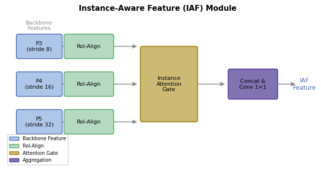
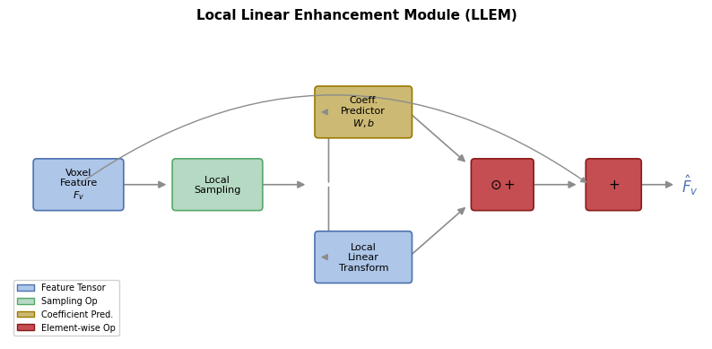
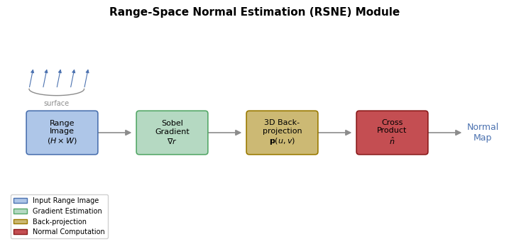
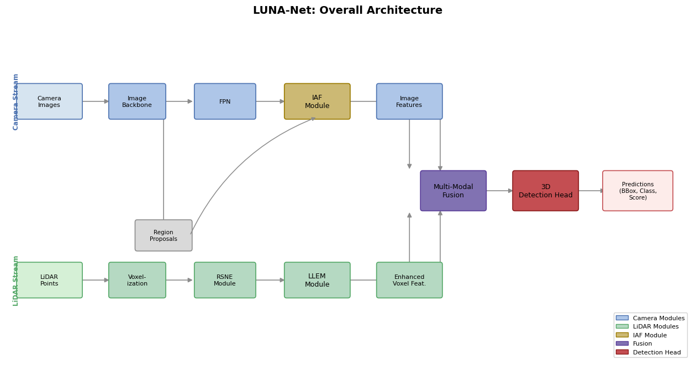
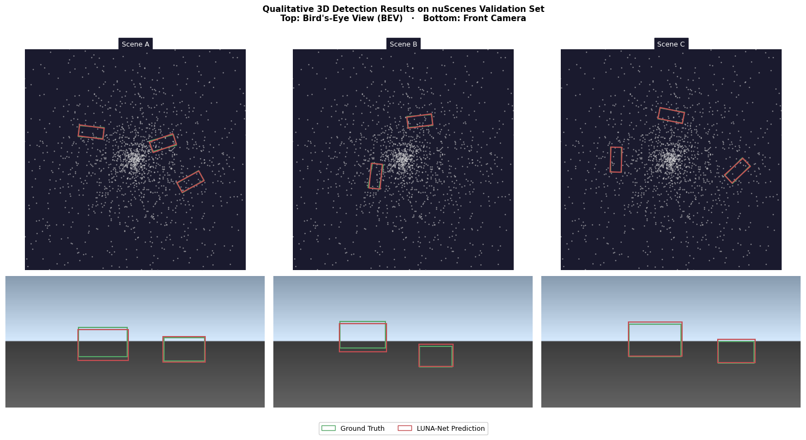

# LUNA-Net-Plot

Python scripts to reproduce the figures in the **LUNA-Net** paper.

## Figures

| Script | Output PDF | Description |
|--------|-----------|-------------|
| `plot_overall_architecture.py` | `fig_overall_architecture.pdf` | Overall LUNA-Net architecture |
| `plot_iaf_module.py` | `fig_iaf_module.pdf` | Instance-Aware Feature (IAF) module |
| `plot_llem_module.py` | `fig_llem_module.pdf` | Local Linear Enhancement Module (LLEM) |
| `plot_rsne_module.py` | `fig_rsne_module.pdf` | Range-Space Normal Estimation (RSNE) module |
| `plot_qualitative_nuscenes.py` | `fig_qualitative_nuscenes.pdf` | Qualitative results on nuScenes |

## Requirements

```bash
pip install -r requirements.txt
```

## Usage

Generate a single figure:

```bash
python plot_overall_architecture.py
python plot_iaf_module.py
python plot_llem_module.py
python plot_rsne_module.py
python plot_qualitative_nuscenes.py
```

Generate all figures at once:

```bash
python generate_all.py
```

## Preview

### IAF Module


### LLEM Module


### RSNE Module


### Overall Architecture


### Qualitative Results – nuScenes

